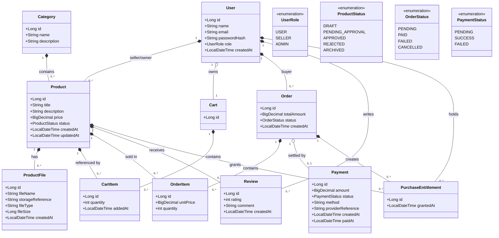

# Class Diagram

> **Status:** PHASE 1 · STEP 3 — Class Design (docs only). No Java source code exists yet.
> Sources of truth: `Problem_Statement.md`, `docs/diagrams/system-architecture.md`, `docs/diagrams/er-diagram.md`.

## 1. Purpose

This class diagram defines the **domain/entity model** for the Digital Products Marketplace as
Java application classes. It is a design document, not a final source file — it deliberately omits
controller/service/repository/DTO plumbing and every method/getter/setter to stay readable. It is
fully consistent with the 11 entities in `er-diagram.md`, the roles and statuses in
`Problem_Statement.md`, and the modular-monolith backend in `system-architecture.md`.

## 2. Domain Classes

| Class | Purpose |
|---|---|
| User | Platform identity with role (USER / SELLER / ADMIN) |
| Category | Product catalog grouping |
| Product | Digital product listing owned by a seller |
| ProductFile | Metadata/reference for the externally stored digital file |
| Cart | One active shopping cart per user |
| CartItem | A product line item inside a cart |
| Order | Buyer's order record with status and total |
| OrderItem | Snapshot of a product inside an order |
| Payment | MVP transaction/payment record for an order |
| Review | Rating/comment by an eligible user |
| PurchaseEntitlement | User's right to access/download a purchased product |

## 3. Class Diagram

> Note: the `*--`/`o--` markers express association/composition semantics at the class level.
> The concrete aggregation vs. composition ownership decision for implementation lives in the
> data model (`er-diagram.md`); composition is shown here for Cart/Order line items.

## 4. Class Responsibilities

| Class | Responsibility |
|---|---|
| User | Identity, credentials, role-based permission source |
| Category | Grouping for the product catalog |
| Product | Digital listing: title, description, price, approval status, seller/category |
| ProductFile | External file metadata and storage reference |
| Cart | Holds a user's selected products before checkout |
| CartItem | One product selection (and quantity) in a cart |
| Order | Finalized purchase record with total and status |
| OrderItem | Historical snapshot of a purchased product |
| Payment | Tracks the transaction that settled an order |
| Review | Buyer feedback on a product |
| PurchaseEntitlement | Records granted access to a purchased product |

## 5. Relationships

- **User → Product:** a seller owns many products; each product has one seller. Buyers own no listings.
- **Category → Product:** one category holds many products; each product is in one category.
- **Product → ProductFile:** a product has one or more file metadata records.
- **User → Cart → CartItem → Product:** one user has one cart; a cart has many items; each item references one product; (cart, product) is unique.
- **User → Order → OrderItem → Product:** a buyer places many orders; an order has one or more line items; each item references one product.
- **Order → Payment:** an order has zero or one payment record for the MVP mock flow.
- **User / Product → Review:** a user writes many reviews; a product receives many reviews; one review per (user, product).
- **Order / User / Product → PurchaseEntitlement:** a successful order creates an entitlement per purchased product; entitlements persist and authorize downloads.

## 6. Important Domain Rules

These are conceptual rules to be enforced later in the service/business layer — **not** implemented here:

- Only **APPROVED** products are purchasable.
- Sellers may only manage **their own** products.
- **OrderItem.unitPrice** preserves the price at purchase time (historical totals do not rely on `Product.price`).
- **PurchaseEntitlement** is what grants access to a purchased digital product.
- Reviews require **purchase ownership** (eligibility is a business rule, not inheritance).
- Download authorization is based on **entitlement**, never on knowing a file URL.
- **User.role** controls platform permissions (USER / SELLER / ADMIN).

## 7. Design Decisions

- **Single User class with a `UserRole` enum** — no `Buyer extends User` / `Seller extends User` / `Admin extends User` inheritance; the finalized design intentionally uses one identity with a role.
- **No subclasses or abstract user hierarchy** — avoids overengineering with no MVP benefit.
- **PurchaseEntitlement as a first-class domain concept** — ownership is the core of the business model; it is the basis for the digital library and authorized downloads.
- **Composition for Cart→CartItem and Order→OrderItem** — line items exist as part of their container; other relationships stay as associations.
- **ProductFile represents metadata only** — actual file contents are stored externally; the class keeps `storageReference` and basic file info.
- **Four justified enums** — `UserRole`, `ProductStatus`, `OrderStatus`, `PaymentStatus`; no invented state machines.
- **No `PaymentProcessor` in this diagram** — it is an application-layer abstraction (see `system-architecture.md`) and belongs in a separate service/application diagram if needed later.

## 8. Consistency Check

- Same 11 core entities as `er-diagram.md` ✅
- Same relationships and multiplicities ✅
- Same roles (USER/SELLER/ADMIN) ✅
- Same statuses (Product/Order/Payment) ✅
- Same purchase/entitlement concept ✅
- Same digital-file (metadata-only) model ✅
- Same modular-monolith architecture ✅
- No unnecessary classes, no contradictory multiplicities, no unexpected inheritance ✅
- No conflicts found; previous documents were not modified.
