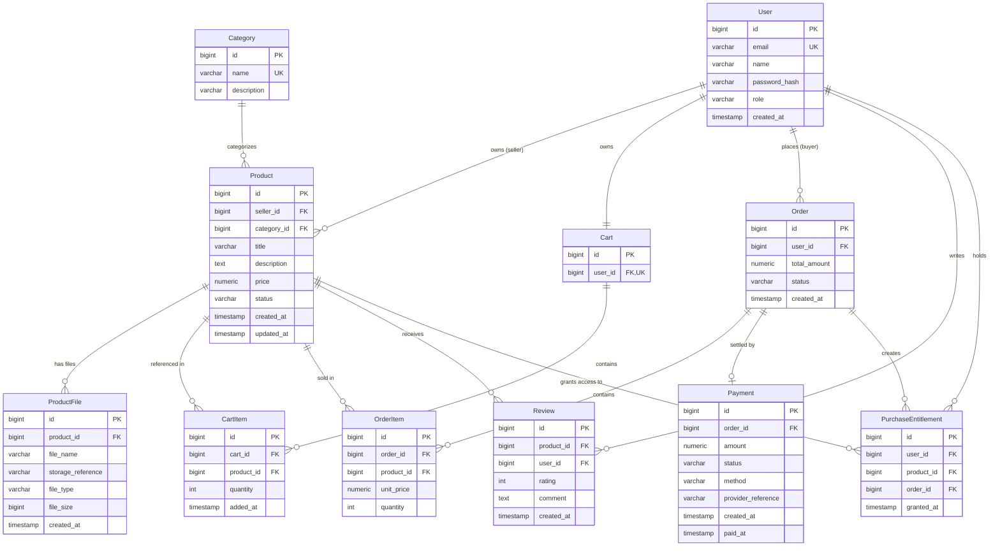

# Entity Relationship Diagram

> **Status:** PHASE 1 · STEP 2 — ER Design (docs only). No DB tables or code exist yet.
> Sources of truth: `Problem_Statement.md` and `docs/diagrams/system-architecture.md`.

## 1. Purpose

This ER model captures the domain for the Digital Products Marketplace MVP: product catalog,
seller ownership, cart/checkout, orders, transactions, purchase ownership, controlled digital
access, and reviews. It is a **conceptual/relational model** — final physical schema, indexes,
and migrations are designed in a later step. It deliberately avoids many-to-many relationships
and unnecessary entities so the 60-day capstone stays buildable.

## 2. Entity Summary

| Entity | Purpose |
|---|---|
| User | Identity + role (USER / SELLER / ADMIN) |
| Category | Product catalog grouping |
| Product | Digital product listing owned by a seller |
| ProductFile | Metadata/reference for the external digital file |
| Cart | Shopping cart (one per user) |
| CartItem | Cart line item referencing a product |
| Order | Buyer's order with totals + status |
| OrderItem | Snapshot of a product in an order |
| Payment | Transaction record tied to an order |
| Review | Rating/comment by an eligible user |
| PurchaseEntitlement | User's right to access/download a purchased product |

## 3. ER Diagram

## 4. Relationship Explanation

- **User → Product:** A seller owns many products; each product belongs to one seller. Buyers do not own listings.
- **Category → Product:** One category contains many products; each product belongs to one category (one-to-many — simpler, and justified by the catalog requirements).
- **Product → ProductFile:** A product has one or more file records; files are stored externally, DB keeps references.
- **User → Cart / Cart → CartItem / CartItem → Product:** One user has one cart; a cart has many items; each item references one product. A product can appear in many carts.
- **User → Order → OrderItem → Product:** A buyer places many orders; an order has one or more line items; each item references one product. `unit_price` is a snapshot of the price at purchase time.
- **Order → Payment:** One payment record settles an order (zero-or-one for MVP; keeps status tracking simple).
- **User/Product → Review:** A user writes many reviews; a product receives many reviews; one review per (user, product).
- **Order/User/Product → PurchaseEntitlement:** A successful order creates entitlements — one per purchased product for the buyer. Entitlements persist independently of the order and are what authorize downloads.

## 5. Important Constraints

- **UNIQUE:** `User.email`; `Category.name`; `Cart.user_id` (one cart per user); `CartItem(cart_id, product_id)`; `Review(user_id, product_id)`; `PurchaseEntitlement(user_id, product_id)`.
- **Foreign keys:** all listed FKs reference their parent table and enforce referential integrity (e.g., `Product.seller_id → User.id`, `Order.user_id → User.id`, `OrderItem.product_id → Product.id`).
- **NOT NULL:** name, email, password_hash, role on User; title, price, status, seller_id, category_id on Product; storage_reference, file_name, file_type on ProductFile; user_id on Cart; quantity on CartItem; total_amount, status, user_id on Order; order_id, amount, status on Payment; rating on Review; user_id, product_id, order_id on PurchaseEntitlement.
- **Status rules:** Product approval lifecycle (DRAFT → PENDING_APPROVAL → APPROVED/REJECTED, plus ARCHIVED); only APPROVED products are purchasable. Order: PENDING → PAID / FAILED / CANCELLED. Payment: PENDING → SUCCESS / FAILED. Entitlements are granted only when the payment/order succeeds.
- **Timestamps** as listed in the diagram (created_at / updated_at / paid_at / granted_at / added_at).

## 6. Design Decisions

- **Single User table with `role`:** USER / SELLER / ADMIN live in one table via a role enum. A separate `SellerProfile` adds no required MVP data and would only complicate registration; seller-specific fields can be added later if justified.
- **PurchaseEntitlement as a core entity:** purchase ownership is the heart of the business model — a user must not access a product without it, and access is granted only after a verified transaction. This directly implements the Problem Statement's entitlement/digital-access concept.
- **Digital files stored outside PostgreSQL:** the DB stores only `ProductFile` metadata and a `storage_reference`; actual files live in the file-storage abstraction. No public, guessable file URLs.
- **Avoided many-to-many relationships:** no junction tables are needed — all relationships are one-to-many (product-category, user-product ownership, etc.), keeping the model simple and aligned with the MVP.
- **Cart as one-to-one with User:** a single active cart per user avoids multi-cart complexity with no MVP justification.
- **One Payment per Order for the MVP:** the mock/sandbox transaction is a single record per order; the payment abstraction in the architecture still allows a real provider later without model redesign.
- **OrderItem snapshots:** `unit_price`/`quantity` preserve the purchase price even if the product's price or status changes later.
- **Review eligibility** is a business rule (requires purchase ownership) enforced later in the service layer, not in the data model.

## 7. Consistency Check

- Product catalog ✅ · seller ownership ✅ · categories ✅ · cart/checkout ✅ · orders/order items ✅
- transactions/payments ✅ · purchase ownership (PurchaseEntitlement) ✅ · controlled digital access ✅
- reviews ✅ · roles USER/SELLER/ADMIN ✅ · digital files separate ✅ · no unnecessary entities ✅
- No contradictions found against `Problem_Statement.md` or `system-architecture.md`.
