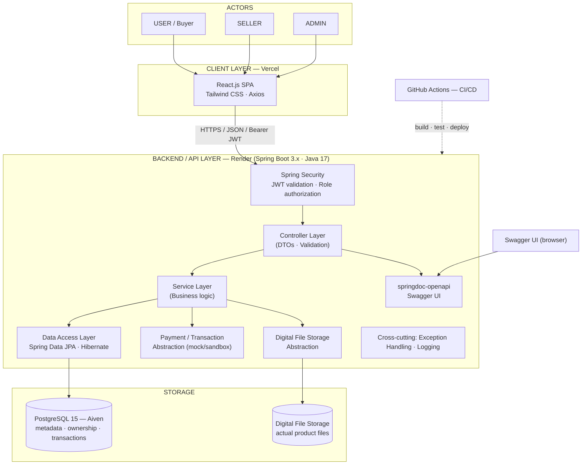

# System Architecture

> **Status:** PHASE 1 · STEP 1 — System Architecture Design (docs only).
> Source of truth: `Problem_Statement.md` (finalized). No application code exists yet.

## 1. Architecture Overview

The Digital Products Marketplace uses a **modular monolith** — a single Spring Boot REST
backend serving a React single-page application, with PostgreSQL as the system of record.

- **Frontend:** React.js + Tailwind CSS + Axios (SPA, deployed to Vercel).
- **Backend:** Spring Boot 3.x / Java 17 / Maven — one stateless REST API (deployed to Render).
- **Database:** PostgreSQL 15 (Aiven), accessed via Spring Data JPA + Hibernate.
- **Security:** Spring Security + JWT (JJWT), stateless, role-based (USER / SELLER / ADMIN).
- **Digital files:** stored outside PostgreSQL; the database keeps only metadata/references,
  accessed through a storage abstraction.
- **Payments:** a transaction/payment abstraction with a mock/sandbox implementation for the MVP;
  a third-party provider can be swapped in later without redesign.

The backend is the single source of truth for authorization, product availability/status,
order totals, transaction status, purchase ownership, and download authorization.

## 2. High-Level Architecture Diagram



## 3. Component Responsibilities

| Component | Responsibility |
|---|---|
| **React SPA (Vercel)** | Rendering, routing, catalog UI, forms, Axios API calls; stores JWT client-side; never enforces security by itself. |
| **Spring Security** | Stateless JWT filter chain; authenticates every `/api/**` request; enforces role authorization (USER/SELLER/ADMIN). |
| **Controller layer** | HTTP mapping, request/response DTOs, `@Valid` input validation. No business logic. |
| **Service layer** | Business rules: product availability/status, cart validation, order total calculation, transaction status, purchase ownership, download authorization, review eligibility. |
| **Data access layer** | Spring Data JPA repositories + Hibernate entities; maps to PostgreSQL. |
| **PostgreSQL 15 (Aiven)** | System of record: users, products, categories, orders, order items, payments, reviews, entitlements, and file references. |
| **Digital file storage abstraction** | Holds actual product files outside the database; exposes controlled access paths; cloud storage swappable later. |
| **Payment/transaction abstraction** | Interface for processing and verifying transactions; MVP uses a mock/sandbox implementation; a real provider can plug in later. |
| **springdoc-openapi / Swagger UI** | Live API documentation and exploration surface. |
| **GitHub Actions** | CI/CD: build, run JUnit 5 tests, deploy frontend/backend. |

## 4. Request Flow

1. Browser → **React SPA** (static assets from Vercel).
2. React → **Axios** → Spring Boot REST API (Render) over HTTPS with `Authorization: Bearer <JWT>`.
3. **Spring Security** validates the JWT and resolves the authenticated user + roles.
4. Request reaches the matching **Controller**, which validates the DTO.
5. **Service** executes business logic (authorization, availability, totals, ownership).
6. **Repository** (Spring Data JPA / Hibernate) reads/writes **PostgreSQL**.
7. Response returns DTO → JSON to the frontend; errors pass through centralized exception handling.
8. **Swagger UI** documents the same controllers for developers.

## 5. Authentication and Authorization Flow

1. **Register:** `POST /api/auth/register` → password hashed (BCrypt), user created (role `USER`).
2. **Login:** `POST /api/auth/login` → credentials verified → backend issues a signed **JWT** (JJWT) containing user id and roles.
3. **Every request:** the token is sent as `Authorization: Bearer <token>`; the JWT filter validates signature/expiry and populates the security context.
4. **Role authorization:** enforced server-side (e.g., `@PreAuthorize("hasRole('SELLER')")`). Users cannot reach seller endpoints; users and sellers cannot reach admin endpoints; sellers can only manage their own products.
5. The backend remains the source of truth — the frontend never grants access on its own.

## 6. Product Purchase Flow

Browse → Search/Filter/Sort → Product Details → **Cart** → **Checkout** → **Transaction/Payment** →
**Verification** → **Order** → **Purchase Entitlement** → **Digital Library** → **Authorized Download**

1. User browses and adds available products to the cart.
2. Checkout creates an order and a transaction via the **payment abstraction**.
3. Transaction is verified; on success the order is finalized and totals are computed server-side.
4. Successful verification creates **purchase ownership / entitlement** for the ordered products.
5. Entitled products appear in the user's **Digital Library**.
6. Download is allowed only after the backend confirms entitlement.

## 7. Digital File Access

- Database stores product **metadata and a file reference**; actual files live in the separate file storage.
- Files are **not** exposed as public, guessable URLs.
- On `GET .../download`, the backend checks that the authenticated user holds **valid purchase ownership/entitlement** before streaming or returning an authorized access path.
- Unentitled or unauthenticated requests are rejected (401/403).

## 8. Deployment Architecture

```
Vercel (React SPA)
      │  HTTPS
      ▼
Render (Spring Boot API)  ──►  Aiven PostgreSQL 15
      │
      └──► Digital File Storage (separate)
```

- **Frontend:** Vercel — static React build, env `VITE_API_URL` → Render API.
- **Backend:** Render — Spring Boot fat-JAR; env `DATABASE_URL`, `JWT_SECRET`.
- **Database:** Aiven PostgreSQL 15.
- **Digital files:** separate storage service/abstraction (cloud object storage later).
- **CI/CD:** GitHub Actions builds/tests and deploys; **Docker** is an optional bonus, planned later.

## 9. Future Extensibility

Explicitly **not** MVP requirements:
- **Payment provider integration** — a real sandbox/third-party gateway behind the payment abstraction.
- **AI enhancement** — e.g., AI-assisted product discovery/recommendation (post-MVP).
- **Docker** — optional containerization bonus.
- **Cloud file storage** — e.g., object storage behind the file-storage abstraction.

All extensions fit the architecture without redesign.
